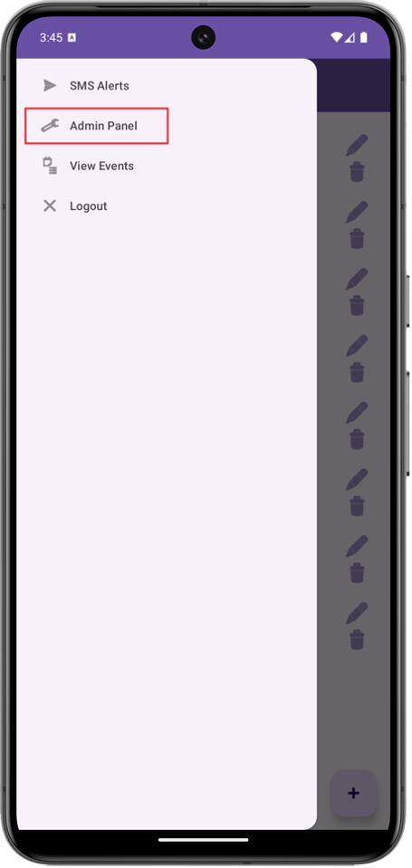
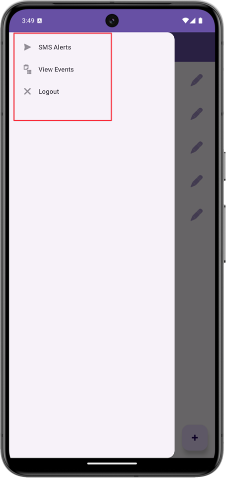
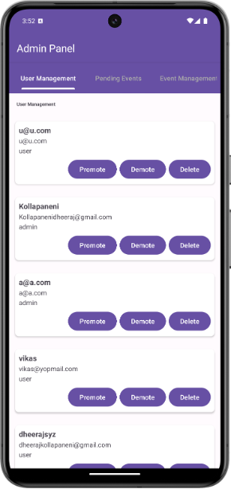
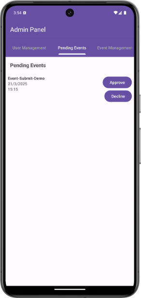
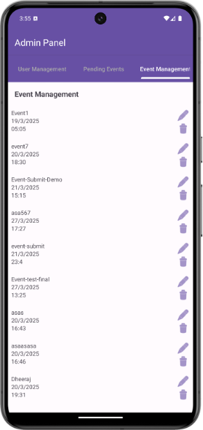
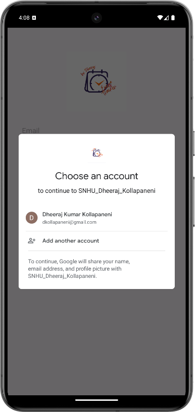
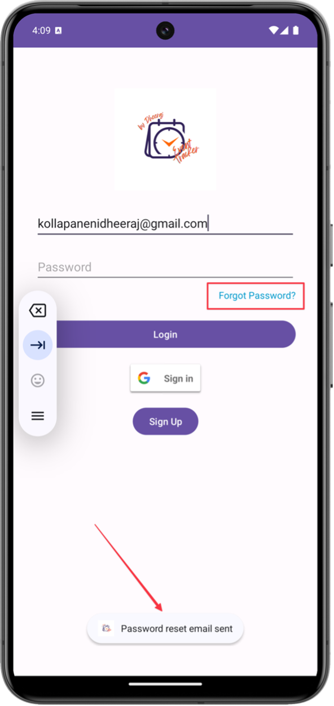
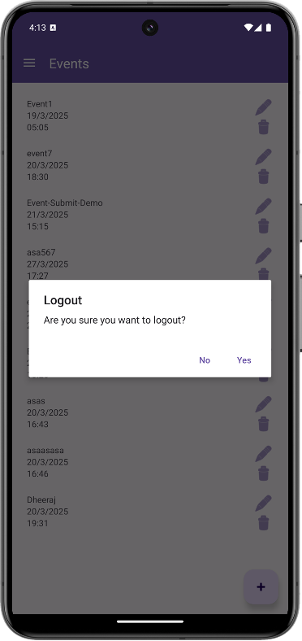
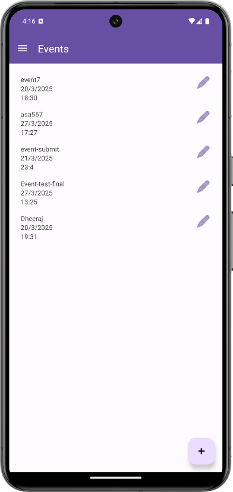
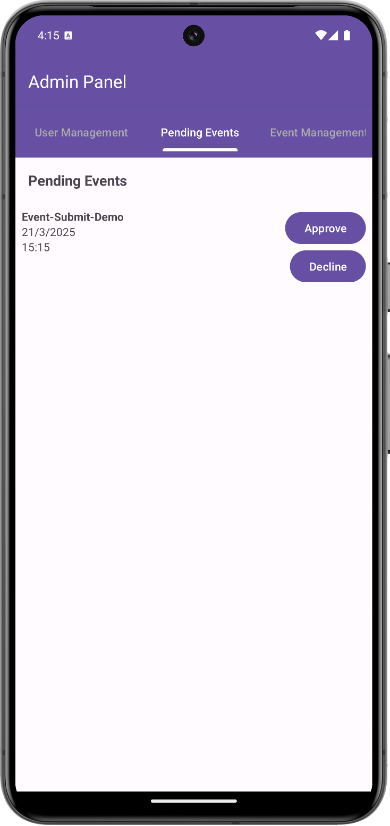

# Enhancement One: Software Design & Engineering

**Author:** Dheeraj Kollapaneni  
**Date:** 03/21/2025

## Artifact Overview

- **Project:** Android Event Manager App (CS-360)  
- **Pre‑Enhancement State:** Basic event creation and viewing with no access control or approval workflows

## Enhancement Focus
**Enhancement One: Software Design/Engineering**

### Summary
I enhanced the Android event management application by introducing robust **security**, **user management**, and **usability** features. Key goals were:

- Implement **role-based access control**  
- Add **secure authentication** methods  
- Create **event approval workflows**  
- Improve overall **usability** and **app structure**

## Role-Based Access Control

- Only **admins** can access the **Admin Panel**  
- Admins can **approve, reject, edit, or delete** events  
- Admins can **promote**, **demote**, or **delete** users  
- Regular users can **submit** and **edit** events, but these remain **hidden until approved**

    
  

## Admin Panel

The Admin Panel features three tabs:

1. **User Management** – View all users; promote/demote/delete accounts  
2. **Pending Events** – Review and approve or reject new submissions  
3. **Event Management** – Full CRUD access to all events

    
    
  

## Google Sign-In & Password Reset

- **Google Sign-In** integration for streamlined login  
- **Forgot Password** feature via Firebase email reset links

    
  

## Logout Confirmation

Added a confirmation dialog to prevent accidental logouts, enhancing user experience and reducing data loss risk.

  

## Admin-Only Event Visibility

- Unapproved events are **hidden** from regular users  
- Admins review submissions before they become publicly visible

    
  

## Engineering Challenges Solved

- Applied **software design principles** for security and structure  
- Handled **Firebase authentication errors** gracefully  
- Fixed **Google Sign-In error code 10** by updating SHA-1 configuration  
- Refined UI layouts to enhance usability and consistency

## Final Outcome

These enhancements demonstrate my capability to:

- Design and implement **secure**, **structured** mobile applications  
- Integrate cloud-based authentication (Firebase & Google Sign-In)  
- Implement and manage **scalable RBAC** systems  
- Elevate app **usability** and **workflow** through informed design choices

---
